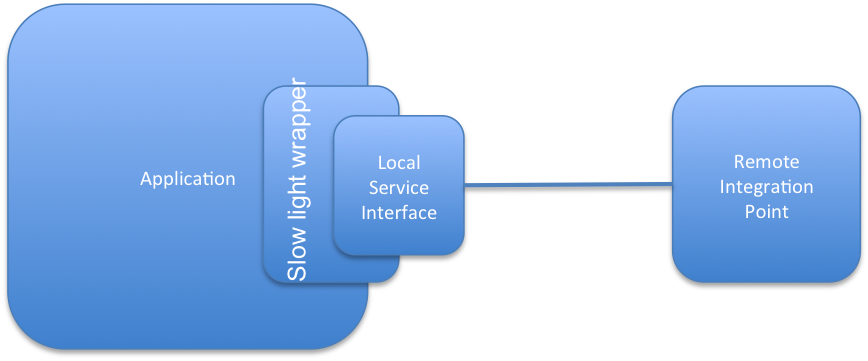
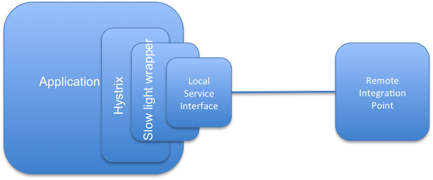
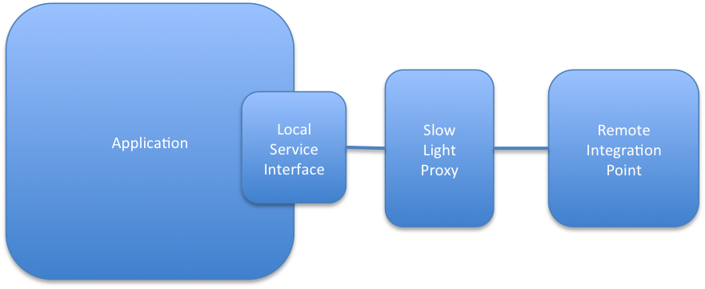
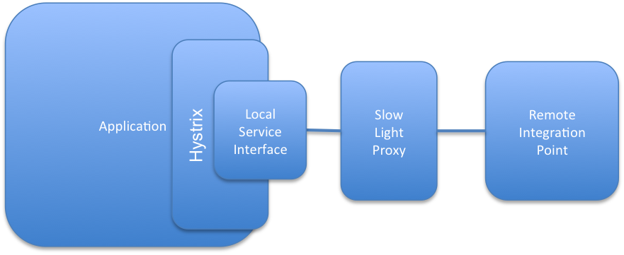

Slow Light [](http://travis-ci.org/tacitknowledge/slow-light)
==========

In 1999, Danish physicist Lene Vestergaard Hau led a combined team from Harvard University and the Rowland Institute
for Science which succeeded in slowing a beam of light to about 17 meters per second.

Slow Light degrades response times of object methods and synchronous remote calls as concurrency increases.

We've used it primarily to test monitoring and fault tolerance of integration points under scalability tests.  We love
using it to test [Hystrix](https://github.com/Netflix/Hystrix) integrations and configurations.

# Introduction and Motivation

Slow Light consists of two sibling tools, [Slow Light Embedded](embedded) and [Slow Light Proxy Server](proxy). Both tools interpose themselves
between a caller and an API to degrade responses, either with response times or error creation.

_Why do this?_ We've found that certain points in system architectures will inevitably experience degradation and
failure.  For instance, an application may leverage a remote address validation service.  That address validation
service, at some point in the future, will probably have an outage or scaling issues or just the network will fail.
Slow Light provides us with the ability to examine the client application's behavior under a variety of scenarios
where a remote service is having issues.  Typically, this is done during performance testing; it often exposes
situations where calls results can be cached better or logic can be made fault tolerant.  We've even seen situations
where degraded responses with a third party caused out-of-memory errors in the JVM because objects could not be released
to garbage collection frequently enough under load.

When Slow Light is combined with specialized Fault Tolerance tools such as [Hystrix](https://github.com/Netflix/Hystrix),
Slow Light becomes similar to testing smoke alarms and automatic sprinkler systems.  Slow Light creates the smoke which
triggers fault tolerance code and sets of alarms.

# Slow Light Architectures

**Slow Light Embedded**

[Slow Light Embedded](embedded) runs inside a Java Process and wraps service interfaces with a [Java Proxy](http://docs.oracle.com/javase/7/docs/api/java/lang/reflect/Proxy.html) that incorporates a
ThreadPool and specialized InvocationHandler; the handler monitors concurrency on the ThreadPool and degrades Proxy
responses according to configuration and concurrency rules.



Slow Light Embedded requires altering code within your application or IoC configuration.  This is a fairly simple
process when using Spring, Guice, PicoContainer, or other IoC injectors that support an AOP model.  When not using one
of these tools, Slow Light Embedded is usually done at service instantiation - often using existing factories.  Many
people provide toggling that enables or disables Slow Light Embedded.

_with Hystrix_
With a Fault Tolerance tool like Hystrix, which also proxies/wraps Service APIs, we insert Hystrix around Slow Light.
Slow Light itself wraps



**Slow Light Proxy Server**

[Slow Light Proxy Server](proxy) is a standalone JVM application that proxies remote, synchronous TCP/IP calls.  It does not require
altering code in client applications as it runs external to the process.  Slow Light Proxy Server uses [Netty](http://netty.io/) and some special
ChannelHandler implementations to slow, delay, discard, forward, and generally play mischevious games with remote
calls.



_with Hystrix_

When using Slow Light Proxy Server with a Fault Tolerance tool like Hystrix, you can achieve the same smoke and smoke alarm
behavior as Slow Light Embedded.



A disadvantage of Slow Light Proxy Server is that it can't create faults and degradation with system resources like file I/O.
If you need to simulate failures in non-network resources, use Slow Light Embedded.

# Use it!

__A Sample from Slow Light Embedded__

In general you just need to do these things:
```java
 //This object needs to have an interface to proxy, but can be real app code, a real service, or a stub
 //  supporting concrete classes without interfaces is a future TODO
 Object targetToWrapInProxy;
 .
 .
 .
 //set up how the service should degrade
 DegradationStrategy degradationStrategy
        = new DefaultDegradationStrategy(serviceDemandTime,
                serviceTimeout,
                passRate,
                new Class<Exception>[]{MyException.class}
          );
 //Set up a NamedThreadFactory. optional but highly suggested to make debugging and monitoring easier.
 //The below code would generate threads with names similar to the below
 // Thread[threadfactory-<factoryname>-groupnumber-1-thread-1],5,parentgroup-main-groupname-<factoryname>1]
 //Spring users may wish to use CustomizableThreadFactory, which supports naming
 ThreadFactory threadFactory = new NamedThreadFactory("<factoryname>");
 //set up a fixed thread pool
 ThreadPoolExecutor executorService = (ThreadPoolExecutor) Executors.newFixedThreadPool(capacity,threadFactory);
 //set up InvocationHandler with execution pool and strategy
 final DegradationHandler handler = new DegradationHandler(conversation,
                executorService, degradationStrategy);
 Object wrappedProxy = Proxy.newProxyInstance(targetToWrapInProxy.getClass().getClassLoader(),
                targetToWrapInProxy.getClass().getInterfaces(),
                handler);
 //now replace calls to target with the wrapped proxy.  In general, pretty simple to integrate with IoC frameworks,
 //                  AOP stuff, or JNDI
```

__A Sample from Slow Light Proxy Server__

This configuration proxies calls between port *10011* and *google.com:80*. It contains three scenarios:
* Simple Proxy (60% of requests)
* Proxy with timed delays for 10 sec (40% of requests)

Scenario is selected proportionally to the request count in each of the scenario.

```xml
<com.tacitknowledge.performance.ServersConfiguration>
    <servers>
        <com.tacitknowledge.performance.Server>
            <port>10011</port>
            <scenarios>
                <!-- Normal scenario -->
                <com.tacitknowledge.performance.Scenario>
                    <components>
                        <com.tacitknowledge.performance.data.Proxy>
                            <remoteHost>google.com</remoteHost>
                            <remotePort>80</remotePort>
                        </com.tacitknowledge.performance.data.Proxy>
                    </components>
                    <weight>6</weight>
                </com.tacitknowledge.performance.Scenario>

                <!-- Timed delay: 10 sec before passing request to proxy delegate -->
                <com.tacitknowledge.performance.Scenario>
                    <components>
                        <com.tacitknowledge.performance.degrade.Delay>
                            <delay>10000</delay>
                            <delayOnRead>true</delayOnRead>
                        </com.tacitknowledge.performance.degrade.Delay>
                        <com.tacitknowledge.performance.data.Proxy>
                            <remoteHost>google.com</remoteHost>
                            <remotePort>80</remotePort>
                        </com.tacitknowledge.performance.data.Proxy>
                    </components>
                    <weight>4</weight>
                </com.tacitknowledge.performance.Scenario>
            </scenarios>
            <scenarioSelector class="com.tacitknowledge.performance.scenario.ProprotionalCountSelector"/>
        </com.tacitknowledge.performance.Server>
    </servers>
<com.tacitknowledge.performance.ServersConfiguration>
```

# Where do I get Slow Light?
-------------------------
Slow Light is open source and is hosted at
[Github](http://github.com/tacitknowledge/slow-light).

You can include Slow Light Embedded in your Maven project via:

    <dependency>
      <groupId>com.tacitknowledge</groupId>
      <artifactId>slowlight</artifactId>
      <version>1.0.1</version>
    </dependency>

Slow Light Proxy Server is not yet released as a jar, but you can build it from code in our _development_ branch

# Notes
The default implementations are thread safe.  You can re-use a single proxy across threads, assuming the target object
is also safe.

# Extension Points
Feel free to write your own DegradationStrategy and pop it into the DegradationHandler

# Future Feature Notes

**stable releases**

Currently the _master_ branch and release version slowlight-1.0.1 reflects the embedded framework capabilities only.
 It is available in the public maven repository as com.tacitknowledge:slowlight:1.0.1
```
     <dependency>
       <groupId>com.tacitknowledge</groupId>
       <artifactId>slowlight</artifactId>
       <version>1.0.1</version>
     </dependency>
```
**unproven stuff**

Slowlight-Proxy is available in the _development_ branch.  You may need to modify code for your needs.

Feature development for embedded mode on concrete objects is also in the development branch.

Neither are ready for public release

# Release Notes

Slow Light development progresses against the _development_ branch, with merges into master at releases.

Currently Slow Light only supports embedded mode in its first release. Slow Light Proxy Server is on track for the second
release. If you are feeling lucky, you can grab the Slow Light Proxy Server code in the development branch.


