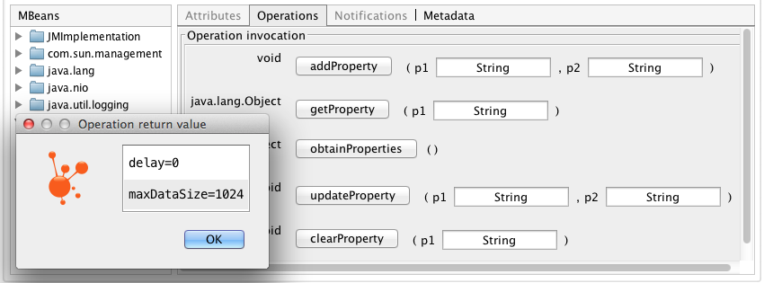

# Slow Light Proxy Server

## How to run
First, build the project with maven:

```
mvn clean install
```

Run *Slow Light Proxy Server* with

```
java -jar slowlight-proxy-<version>.jar config.json
```

## Sample configurations

### No delays, just proxying TCP/IP.
This configuration will run server on localhost:10011 and will proxy requests to google:80

```json
{
    "serverTypes" : {
        "simple" : "com.tacitknowledge.slowlight.proxyserver.server.simple.SimpleServer",
        "proxy" : "com.tacitknowledge.slowlight.proxyserver.server.proxy.ProxyServer"
    },

    "servers" : [
        {
            "id" : "proxyServerExample",
            "type" : "proxy",
            "localPort" : "10011",
            "params" : {
                "host" : "google.com",
                "port" : "80"
            }
        }
    ]
}
```

### Timed delays and packet discards

This configuration contains 3 scenarios:
* Simple Proxy (first 2 min)
* Proxy with specified (1KB/s) timed delays (after 2 min)
* Discard incoming packets and keep connection open (after 5 min)

```json
{
    "id" : "solrServer",
    "type" : "proxy",
    "localPort" : "9012",
    "params" : {
        "host" : "localhost",
        "port" : "8983"
    },
    "handlers" : [
        {
            "name" : "delayHandler",
            "type" : "com.tacitknowledge.slowlight.proxyserver.handler.DelayChannelHandler",
            "params" : {"maxDataSize" : "0", "delay" : "0", "timeFrame" : "5"},
            "behaviorFunctions" : [
                {
                    "paramName" : "delay",
                    "type" : "com.tacitknowledge.slowlight.proxyserver.handler.behavior.LinearBehavior",
                    "start" : "120000",
                    "stop" : "130000",
                    "params" : {
                        "value" : "1000"
                    }
                },
                {
                    "paramName" : "maxDataSize",
                    "type" : "com.tacitknowledge.slowlight.proxyserver.handler.behavior.LinearBehavior",
                    "start" : "120000",
                    "stop" : "130000",
                    "params" : {
                        "value" : "1024"
                    }
                }
            ]
        },
        {
            "name" : "discardHandler",
            "type" : "com.tacitknowledge.slowlight.proxyserver.handler.DiscardChannelHandler",
            "params" : {"enabled" : "false", "timeFrame" : "5"},
            "behaviorFunctions" : [
                {
                    "paramName" : "enabled",
                    "type" : "com.tacitknowledge.slowlight.proxyserver.handler.behavior.LinearBehavior",
                    "start" : "300000",
                    "stop" : "310000",
                    "params" : {
                        "value" : "true"
                    }
                }
            ]
        }
    ]
}
```

## Available handlers

* com.tacitknowledge.slowlight.proxyserver.handler.CloseConnectionChannelHandler - closes connection after a given time
* com.tacitknowledge.slowlight.proxyserver.handler.DelayChannelHandler - delays response data by specified time
* com.tacitknowledge.slowlight.proxyserver.handler.DiscardChannelHandler - discards request data and keeps the connection open
* com.tacitknowledge.slowlight.proxyserver.handler.RandomDataChannelHandler - generates random data by specified parameters
* com.tacitknowledge.slowlight.proxyserver.handler.LogChannelHandler - logs some basic information about request/response messages

## JMX

All Slow Light channel handlers will expose their parameters to JMX, as for example in case of DelayChannelHandler
those parameters will be 'delay' and 'maxDataSize'. Using a any JMX Client someone could connect to the running Slow Light application
and adjust the values of those parameters on demand, what will have an immediate effect on the handler behavior.

An example on how to adjust a handler parameter using jvisualvm:

- go to MBean tab and select slowlight-config folder, where you will see the name of all registered handlers:


- now using MBean property operations you can view or update parameter with new values:



## configuration notes
Slow Light Proxy Server uses Gson to load the ServersConfiguration object graph from the specified configuration file.

## Running several servers on different ports
One can run as many servers as needed on different ports. Each server may contain different set of handlers and
different proxy delegates.
